# Manual

&#x20;iniciar la aplicación veremos la pantalla de inicio de sesión y nos pedirá permiso para las notificaciones

<figure><figcaption>
La primera vez que entramos a la app el texto  de asistencia aparece solo y cambiando de color
</figcaption></figure>

La primera vez que entremos el cuadro de texto de explicación sale solo y va cambiando de color para llamar la atención del usuario, ya que es importante que lo lea

<figure><figcaption>
Si le damos a iniciar sesión vemos esta pantalla
</figcaption></figure>

 

<figure><figcaption>
Cuando le damos a Iniciar con Google
</figcaption></figure>

 

<figure><figcaption>
En cualquier caso de intentar autenticarse
</figcaption></figure>

El proceso de autenticación, ya sea con correo o con Google, es simple, escribiendo a mano el correo podemos enviar del tirón desde el teclado, o desde el botón de check, con google simplemente pulsamos y elegimos cuenta, habrá una breve carga de datos

<figure><figcaption>
Pantalla principal
</figcaption></figure>

Una vez registrados (o iniciemos la app una vez autenticados), veremos esta pantalla, que nos deja entrar a las distintas categorías que hay registradas en el momento, así como crear publicaciones en estas

<figure><figcaption>
Pantalla de perfil propio (publicaciones)
</figcaption></figure>

 

<figure><figcaption>
Pantalla de perfil propio (mascotas)
</figcaption></figure>

 

<figure><figcaption>
Perfil nuevo, en caso de los de google toma su foto de google
</figcaption></figure>

En la pantalla de perfil propio podemos ver la información del usuario, así como editarla, para cambiar entre publicaciones y mascotas podemos tanto pulsar el botón del referido o deslizar horizontalmente

<figure><figcaption>
Cuando estamos editando el nombre de usuario
</figcaption></figure>

 

<figure><figcaption>
Al pulsar para cambiar la foto de perfil
</figcaption></figure>

 

<figure><figcaption>
Al no seleccionar nada
</figcaption></figure>

La personalización es muy básica, al pulsar el lapiz podremos editar el nombre de usuario, y al tocar la foto de perfil podremos seleccionar la nueva de la galería directamente

<figure><figcaption>
Pantalla de registro de mascota
</figcaption></figure>

 

<figure>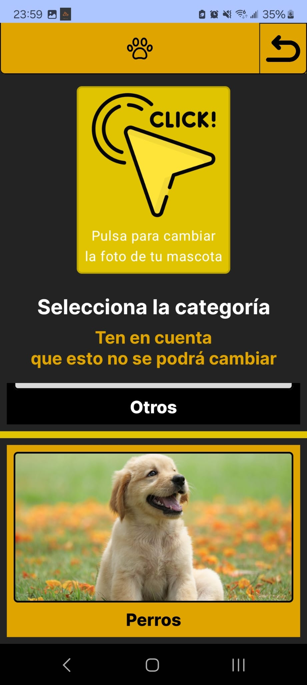<figcaption>
Especie seleccionada
</figcaption></figure>

 

<figure>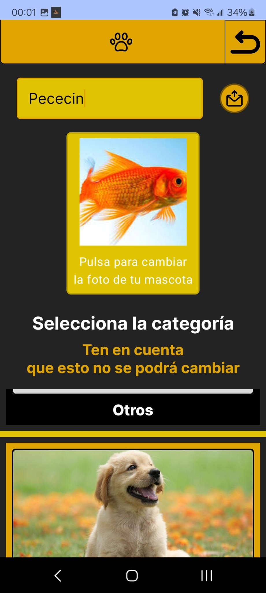<figcaption>
Datos rellenos
</figcaption></figure>

 

<figure>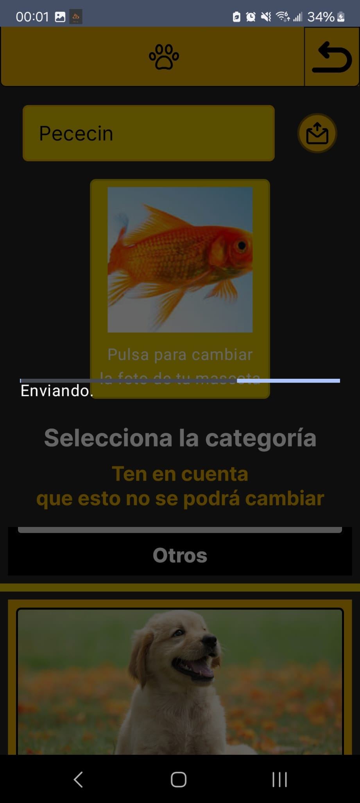<figcaption>
Enviando
</figcaption></figure>

La pantalla de registro de mascota nos da lo necesario para crear una mascota nueva, seleccionamos la especie a la que corresponde, le damos nombre, foto de perfil, y le damos a enviar, lo que nos pondrá una pestaña que nos inmoviliza hasta que termina

Esta pestaña sale si acabamos de registrarnos de forma automática

<figure><figcaption>
Pantalla de publicar
</figcaption></figure>

 

<figure>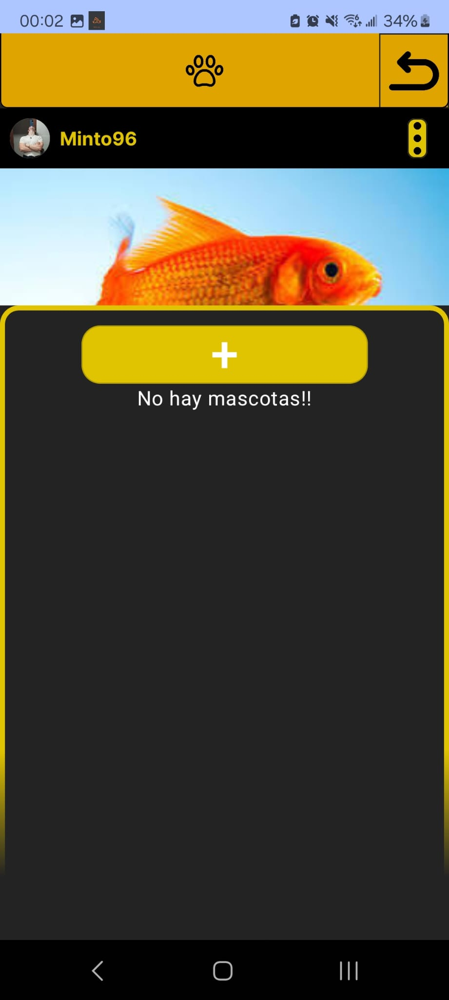<figcaption>
No tenemos mascotas
</figcaption></figure>

 

<figure>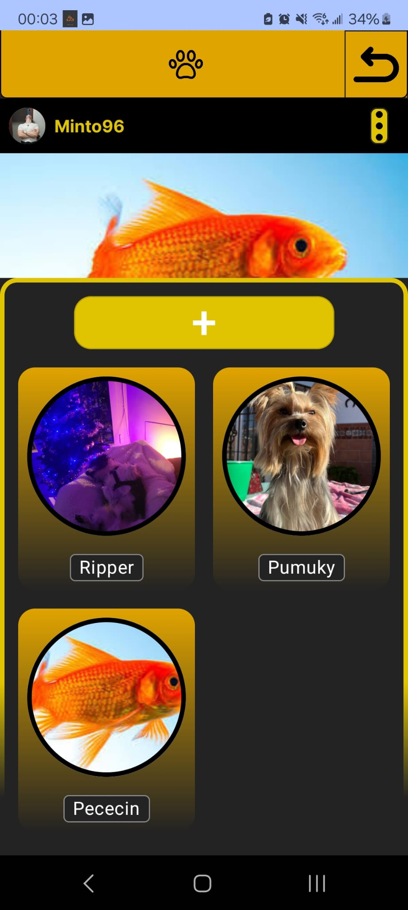<figcaption>
Tenemos mascotas
</figcaption></figure>

 

<figure>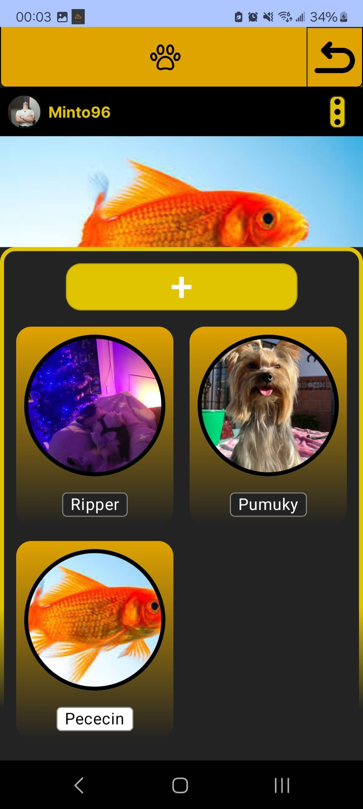<figcaption>
Hemos seleccionado a pececin
</figcaption></figure>

 

<figure>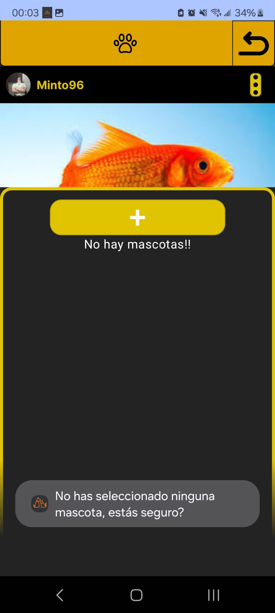<figcaption>
Hemos intentado publicar sin seleccionar
</figcaption></figure>

En la pantalla de publicación tenemos lo necesario para publicar un video/foto, al clicar el recurso saldrá para seleccionar el nuevo recurso, tenemos un cuadro de texto para rellenar el título, y un botón para seleccionar mascota

Si intentamos publicar sin seleccionar mascota nos dirá que nos lo pensemos, si insistimos se subirá sin asignar una mascota

<figure><figcaption>
Progreso de subida
</figcaption></figure>

 

<figure>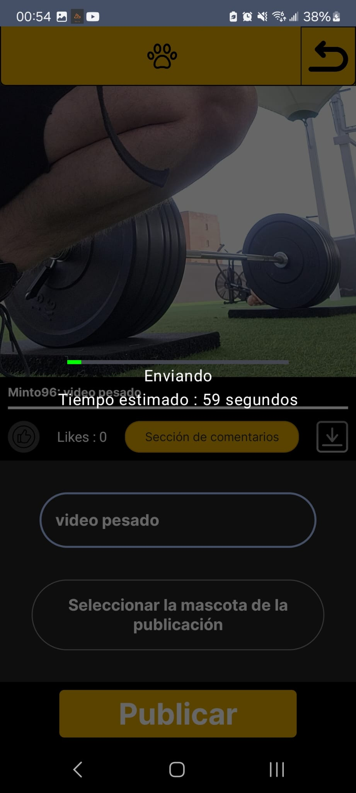<figcaption>
Progreso de subida
</figcaption></figure>

Cuando pulsamos enviar la app bloquea todas nuestras acciones y nos muestra una barra de progreso que representa la proporción del video/imagen enviada y por regla de 3, cuánto queda más o menos de subida

<figure><figcaption>
Publicacion standard, botones visibles
</figcaption></figure>

 

<figure>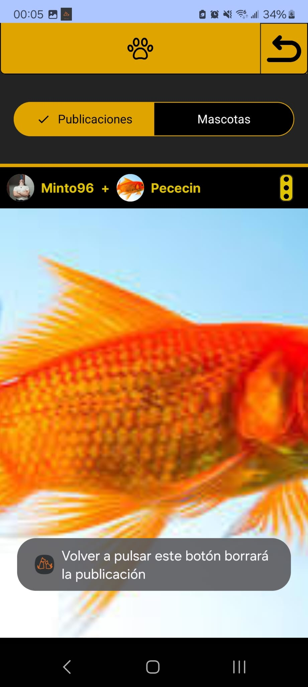<figcaption>
Hemos pulsado borrar
</figcaption></figure>

 

<figure>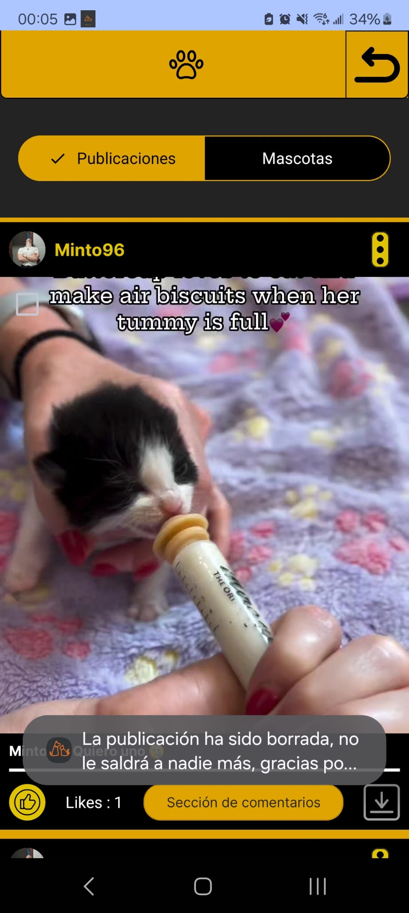<figcaption>
Insistimos en borrar
</figcaption></figure>

 

<figure>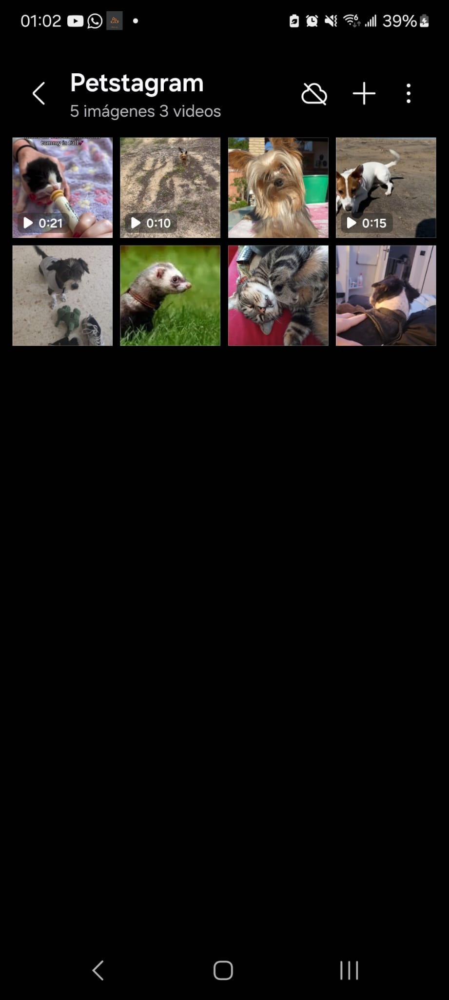<figcaption>
Carpeta Petstagram
</figcaption></figure>

Las interacciones con las publicaciones son simples, al abrir los 3 botones de arriba tendremos 3 opciones, si es publicación propia, borrar, para la cual tendremos que pulsar 2 veces, descargar y cancerlar, si pulsamos descargar se irá a la carpeta "Petstagram", en DCIM

<figure><figcaption>
Al dar like
</figcaption></figure>

 

<figure>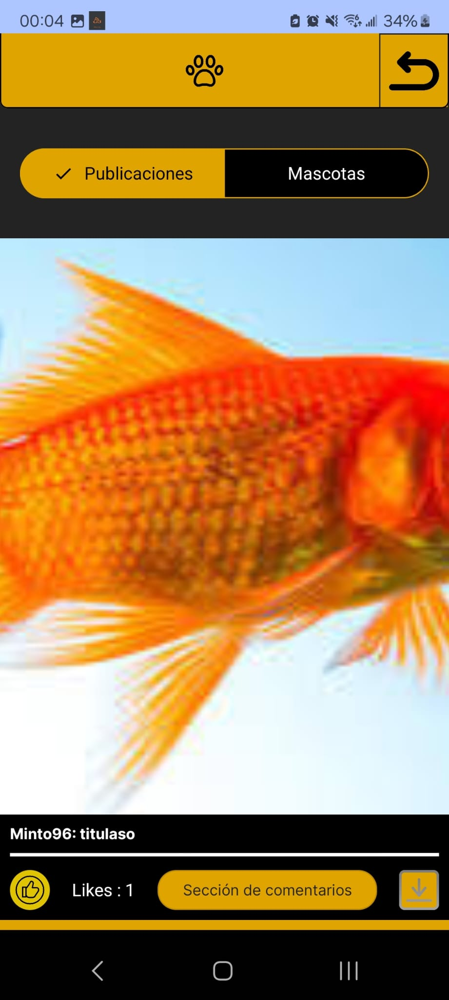<figcaption>
Al pulsar guardar
</figcaption></figure>

 

<figure>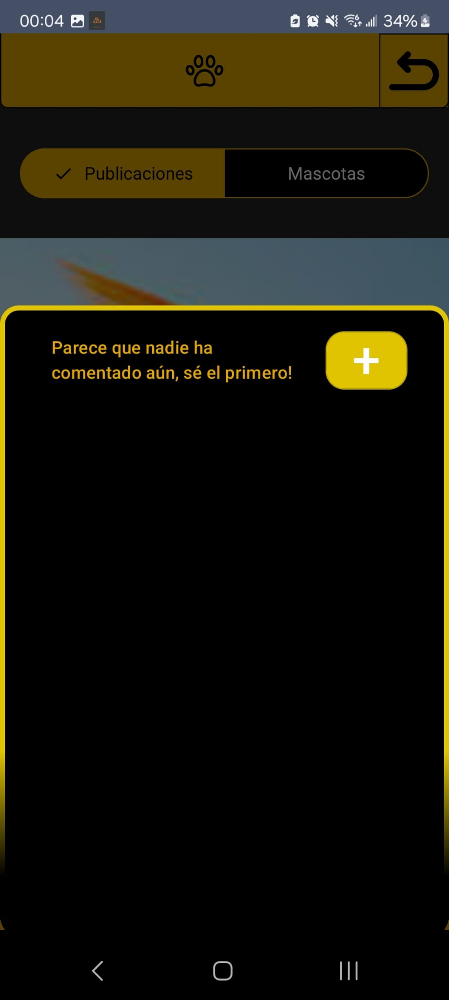<figcaption>
Al ver comentarios
</figcaption></figure>

<figure>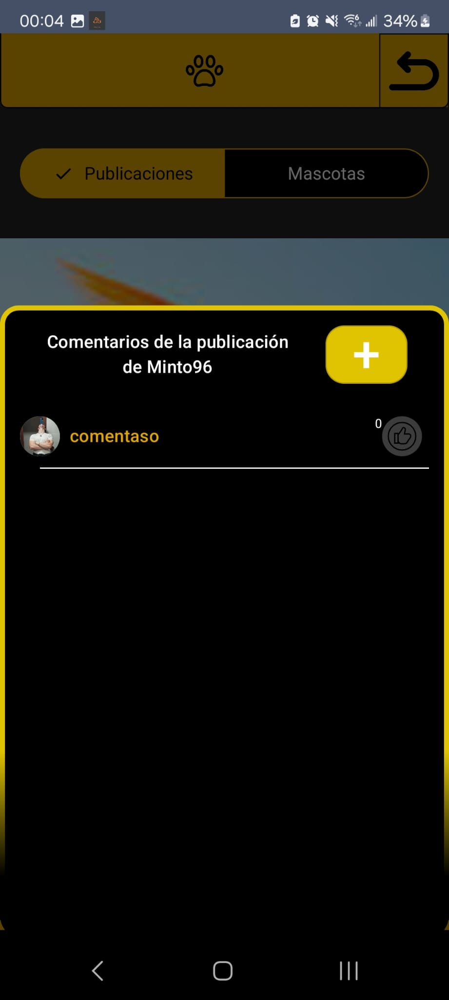<figcaption>
Comentado
</figcaption></figure>

 

<figure>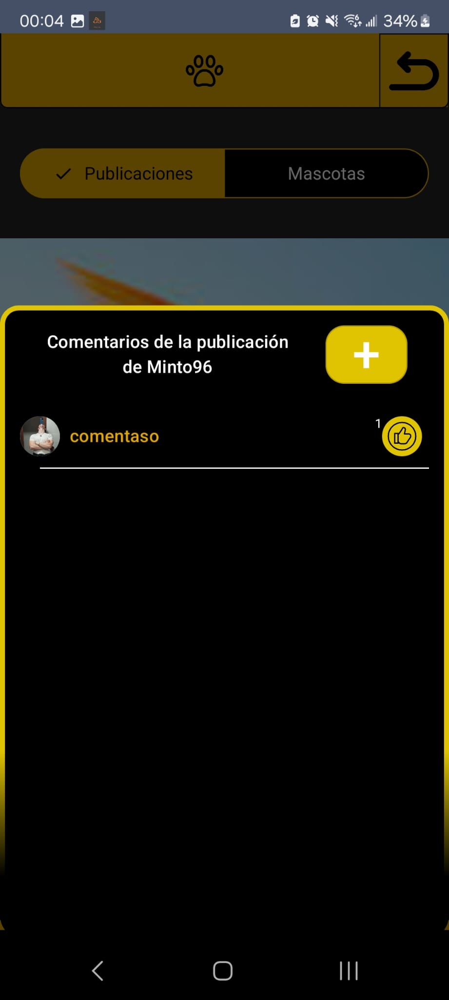<figcaption>
Comentario con like
</figcaption></figure>

 

<figure>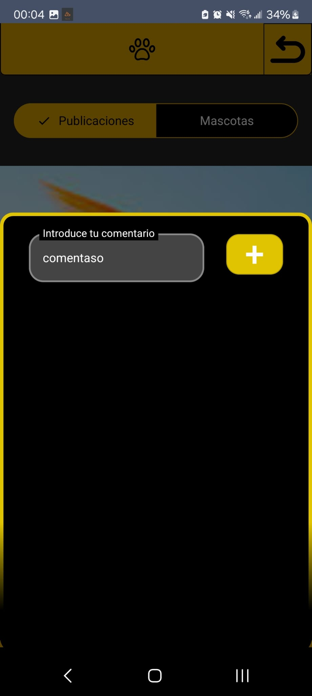<figcaption>
Comentanto
</figcaption></figure>

Las demás interacciones son simples, al dar doble tap al recurso o tap normal al botón de like le podremos dar/quitar el like, con animación incluida, al pulsar los comentarios se mostrarán como un diálogo, podremos añadirlos al pulsar el botón de +, y podremos darles likes con un botón, aparte de entrar a los perfiles tanto de los publicadores (dueño y mascota) como de los comentadores

<figure><figcaption>
Perfil de mascota propia
</figcaption></figure>

 

<figure>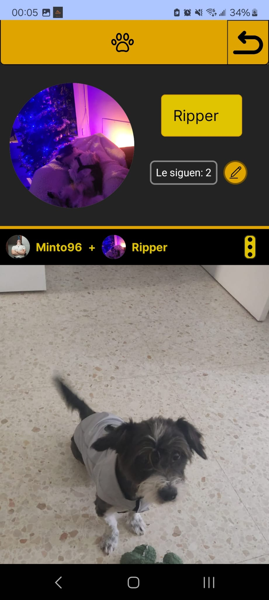<figcaption>
Editando perfil de mascota propia
</figcaption></figure>

<figure>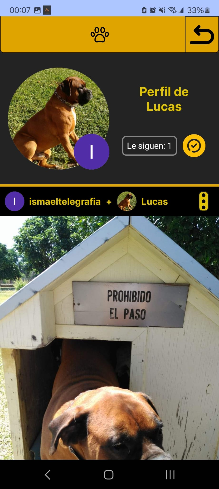<figcaption>
Animación de seguir
</figcaption></figure>

 

<figure><figcaption>
Seguida
</figcaption></figure>

Las pantallas de perfil de mascota son algo simples, si es propia puedes editar su nombre como en tu perfil, y la foto igual, si es ajena puedes ver sus publicaciones y adicionalmente sale la foto de su dueño para que veas su perfil también, aparte de que la puedes seguir

<figure><figcaption>
Perfil ajeno (posts)
</figcaption></figure>

 

<figure>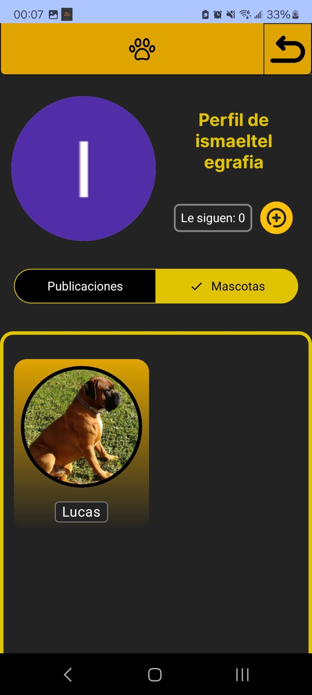<figcaption>
Perfil ajeno (mascotas)
</figcaption></figure>

 

<figure>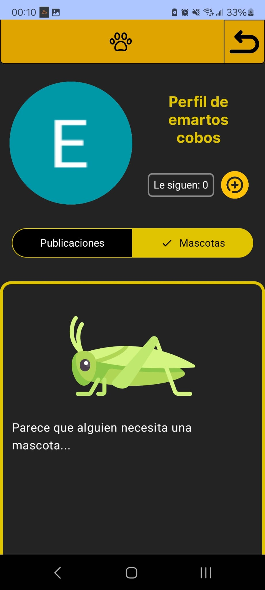<figcaption>
Easter egg
</figcaption></figure>

Mismo funcionamiento que perfil propio, solo que sin poder editar, y pudiendo seguir al usuario, hay un pequeño easter egg, en caso de que el usuario decida no subir mascota

<figure><figcaption>
Pantalla de publicaciones
</figcaption></figure>

La pantalla de publicaciones no tiene nada que no hayamos visto ya, abajo del todo tendremos un acceso a la pantalla de publicar

<figure><figcaption>
Sin filtrar
</figcaption></figure>

 

<figure>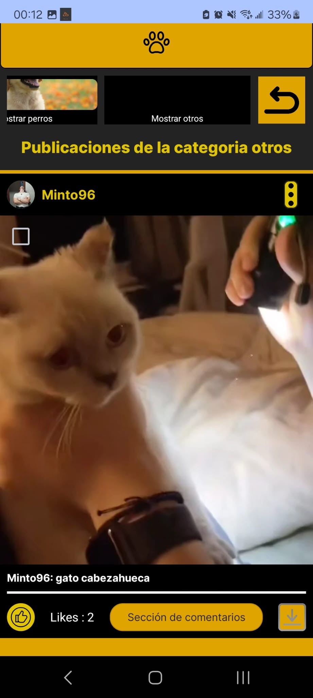<figcaption>
Filtrando por categoria "otros"
</figcaption></figure>

La Pantalla de publicaciones guardadas es como la de categorías pero tomando las publicaciones que el usuario ha guardado, este también cuenta con una barra para filtrar por categoría

<figure>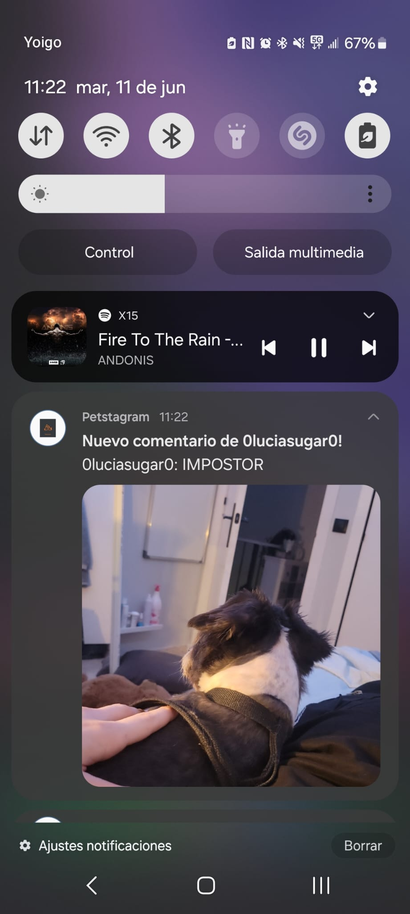<figcaption>
Comentario
</figcaption></figure>

 

<figure>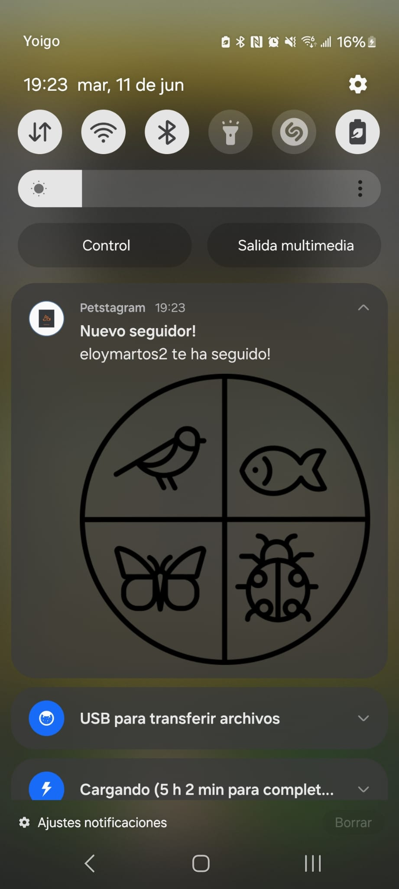<figcaption>
Seguidor nuevo
</figcaption></figure>

 

<figure>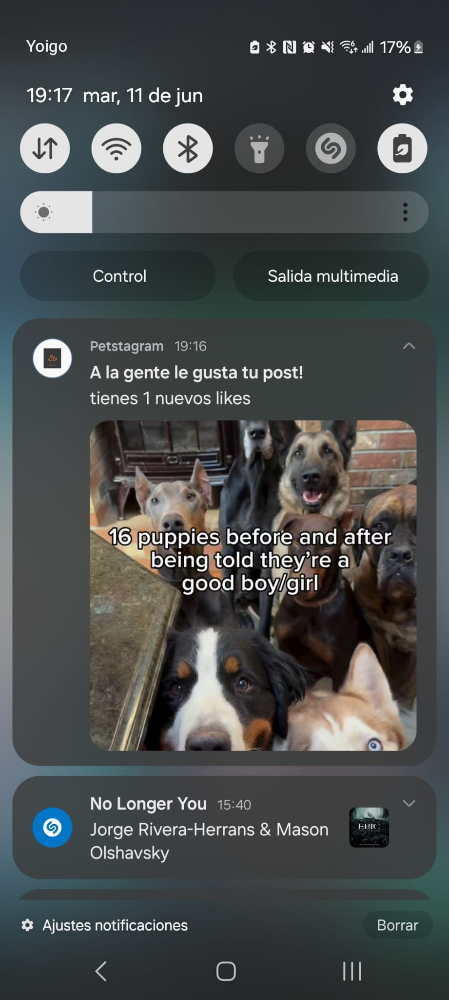<figcaption>
Like nuevo
</figcaption></figure>

 

<figure><figcaption>
Notificacion de nuevo post
</figcaption></figure>

Notificaciones varias

Estas dependen del dispositivo, cada una da a entender algo, que nos han comentado (muestra el comentario y una preview de la publicación) o dado like (muestra cuántos nuevos hay + preview de la publicación) a alguna publicación, que nos ha seguido alguien nuevo (nos dice quién y su foto de perfil) o si alguien o alguna mascota (en esa preferencia) que seguimos ha publicado algo nuevo (nos muestra el titulo y una preview de la publicación)

<figure><figcaption>
Modo reducido
</figcaption></figure>

 

<figure>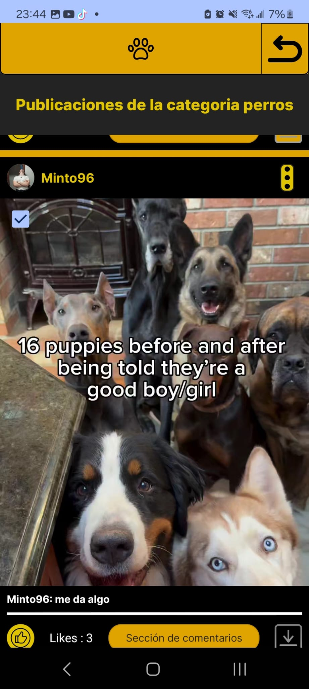<figcaption>
Modo amplio
</figcaption></figure>

 

<figure>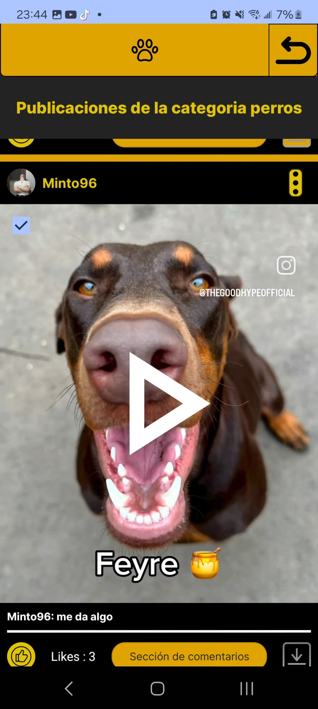<figcaption>
Pausando
</figcaption></figure>

 

<figure>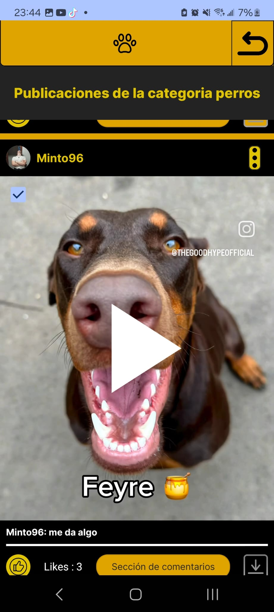<figcaption>
Reproduciendo
</figcaption></figure>

 

<figure>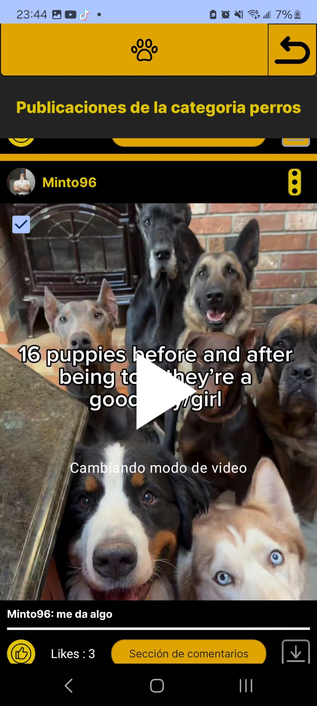<figcaption>
Cambiando modo
</figcaption></figure>

Interacción con videos

El doble tap sigue funcionando como like, pero, para ahorrar recursos y por comodidad del usuario, solo se podrá reproducir el primer video que esté en pantalla, y solo mientras no se esté deslizando, de mientras, todos los videos serán sustituidos por su primer frame, podemos pararlos dandole un toque, lo mismo para reproducirlos

Adicionalmente, se ha añadido un modo solo imágen, el cual funciona manteniendo pulsado, este hace que no se reproduzca ningún video, hasta que hagamos tap o mantengamos pulsado algun video
