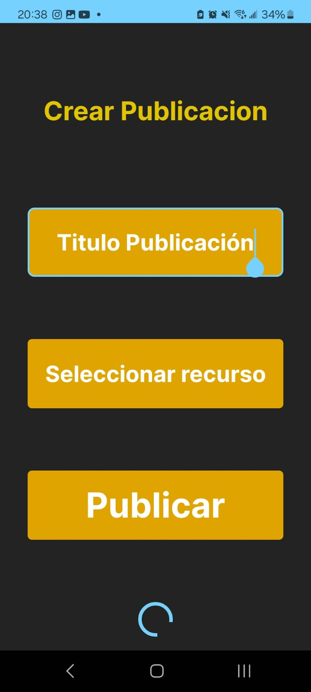
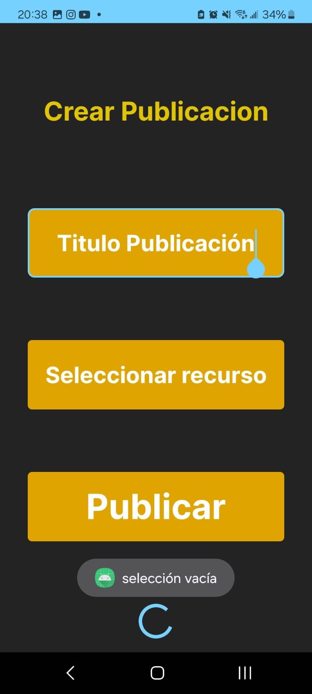
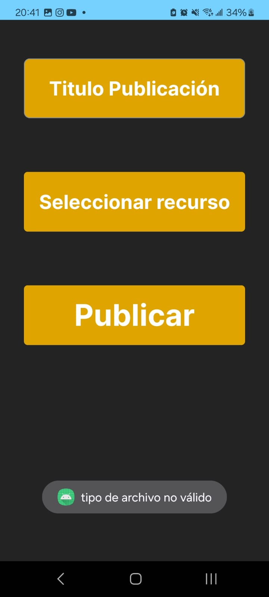

# Interfaz de creacion de publicacion

<figure><figcaption>
aun no hemos seleccionado recurso
</figcaption></figure>

 

<figure><figcaption>
no hemos seleccionado nada
</figcaption></figure>

 

<figure><figcaption>
recurso seleccionado
</figcaption></figure>

 

<figure><figcaption>
tipo de archivo no válido
</figcaption></figure>

Aqui tenemos un campo de input de texto para el título y un boton para seleccionar recurso

Al seleccionar recurso el usuario puede no seleccionar nada o incluso seleccionar algo que no sea video o audio, en cuyo caso se notificará al usuario y no le dejará hacer la publicación
