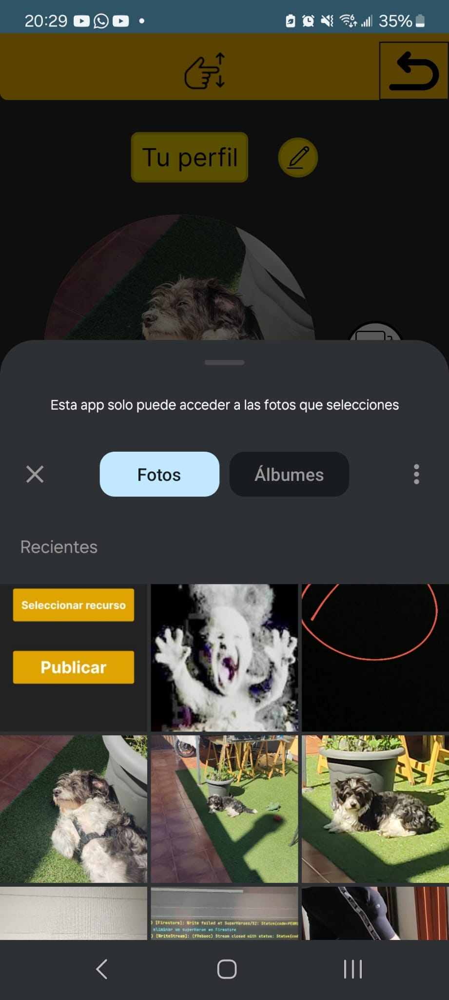
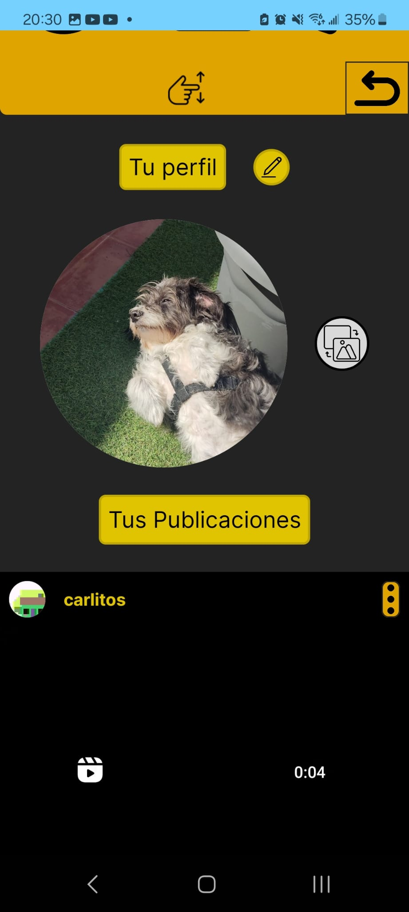

# Interfaz de perfil

<figure><figcaption></figcaption></figure>

 

<figure><figcaption></figcaption></figure>

<figure><figcaption>
perfil base
</figcaption></figure>

 

<figure><figcaption>
Al intentar cambiar a un nombre ocupado
</figcaption></figure>

 

<figure><figcaption>
una vez hemos cambiado de nombre de usuario
</figcaption></figure>

<figure><figcaption>
Si no seleccionas nada
</figcaption></figure>

 

<figure><figcaption>
Al pulsar editar foto
</figcaption></figure>

 

<figure><figcaption>
Una vez cambiada
</figcaption></figure>

En este componente se muestran la foto de perfil del usuario y sus publicaciones

Las publicaciones se van actualizando constantemente pero si la foto de perfil cambia, la de las publicaciones quedará como la antigua hasta reiniciar

Al pulsar el boton al lado de "tu perfil" te dejan editar tu nombre de usuario, al volver a pulsar el botón se valida el nombre de usuario, si ya está usado lo informa por pantalla

Mientras editas se para la actualización para que el nombre de usuario no se reinicie al que ya había

Al pulsar el botón de actualizar la foto de perfil nos sale el menú de nuestro movil pidiéndonos seleccionar una, si no seleccionamos nada se nos indicará por pantalla
