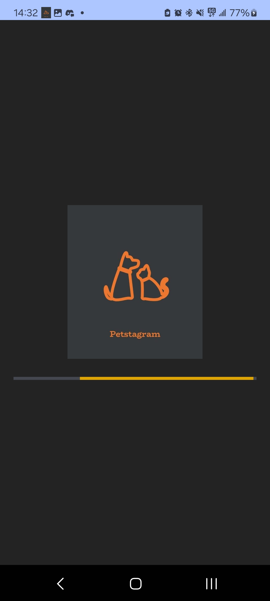
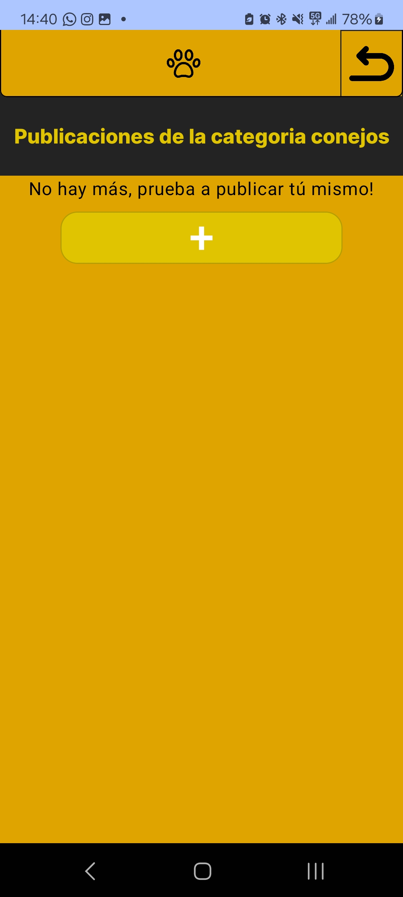
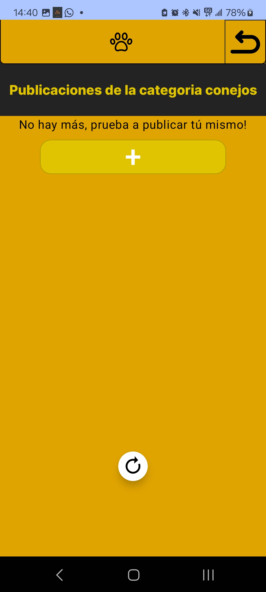

# Pruebas

A lo largo del desarrollo de la app se han ido probando todas las posibles acciones del usuario para evitar la mayor cantidad de errores posibles

## Publicación de post

Al momento de estar subiendo el recurso le puede dar la curiosidad al usuario de qué pasaría si cerrara la aplicación, para calmarlo, hemos bloqueado sus acciones de forma temporal, y para que sepa si está habiendo progreso, le hemos puesto una barra que indica el progreso, además de una estimación de tiempo restante, en caso de que este decida cerrar la publicación, el próximo usuario que intente bajar el recurso verá que no existe o está incompleto, y automáticamente borrará la información del servidor sobre este

## Cambiado de fotos de perfil

Mismo caso, un usuario gracioso que decide cerrar la aplicación cuando acaba de cambiar su foto de perfil o la de su mascota, lo que hacemos es que no se aplican los cambios de información sobre la foto hasta que se termina de subir, así, si cierran la app mientras se sube una foto de perfil, simplemente no afecta a nada

## Descarga de recursos de publicación

Si el usuario quiere descargar una publicación pero aún no se ha cargado, debido a que lo que hacemos, para evitar tráfico, es copiar el recurso temporal que ya tenemos descargado a la carpeta de la galería, la interfaz avisará de que aún es pronto para descargarlo y borrará la instancia de archivo que ha creado para rellenar

<figure><figcaption></figcaption></figure>

## Carga inicial de datos

Ya que al iniciar se tarda unos segundos en tener el usuario y esto generaba muchos "crashes", se implementó una pantalla de carga que hasta que no tengamos usuario, no da paso a la interfaz útil

<figure><figcaption></figcaption></figure>

## Carga de publicaciones

Caso parecido, el usuario entra antes de que haya nada, lo cual es un problema porque la interfaz carga según llegas a abajo, solucion? arrastra hacia arriba, esto pedirá más publicaciones de forma manual

<figure><figcaption></figcaption></figure>

 

<figure><figcaption></figcaption></figure>

## Escritura y animaciones

Resulta que si el foco de atención del teclado está sobre un cuadro de texto y animamos el cambio de pantalla, el foco no sabe donde apuntar, y "crashea"!, la solución fué vaciar el foco de atención a cada cambio de pestaña
